# B28 Housing Market Analysis

*Tools Used: Python (Jupiter Notebook), Power BI*

## Background
A research on the housing market in **B28, Birmingham, UK**; to provide the real estate agency manager with insights into housing prices, property types, sizes and features. With further investigations aim to analyze: 
- How does the local market compare to the wider market?
- Key factors influencing property prices.
- The statistical models to estimate property values based on features like types, size, facilities, and locations.

## Data sources and Files
Properties data were collected in December 2024, on [www.righmove.co.uk](www.righmove.co.uk), with all **720** for sale properties within a **1-mile radius** of the **B28** area, **Birmingham, UK**. 
- The datasets of the analysis can be found in the [datasets](./datasets) folder.
- The Interactive Power BI Dashboard can be downdloaded [here](./B28_BI_Report.pbix).
- The detailed Statistical Analysis can be found [here](./main_analysis.ipynb).
- The Web-scraping Python Programs can be found [here](./data_scraping.py) and [here](./detail_scraping.py)

The Project's directory structure:
```
B28 housing market analysis/
├── visuals/
├── datasets/
│   ├── [all]B28_properties_raw.csv # Raw scraped property data
│   ├── [all]B28_properties_cleaned.csv # Cleaned property data
│   ├── [sample]B28_120_properties.csv # Subset of 120 sampled properties
│   ├── [test_sample]B28_30_properties.csv # Subset of 30 sampled properties for model validation
│   ├── Power_BI_data.csv # Subset of the same 120 properties for BI report
│   └── ...
├── data_scraping.py # 1st step: scrape data of all properties of any desired area on righmove.co.uk
├── wrangling.ipynb # 2nd step: data cleaning
├── sampling.ipynb # 3rd step: get samples for later analysis
├── detail_scraping.py # 4th step: scrape detailed data for sampled sets
├── main_analysis.ipynb # 5th step: main analysis
├── B28_BI_Report.pbix # Power BI interactive dashboard
└── readme.md
```

## Executive Summary

### Market Overview:
-  **4** most popular types: `Detached`, `Semi-Detached`, `Terraced`, and `Flat`.
-  Most popular type: `Semi-Detached`, with **35%**.
-  Average price in **B28** area: **£352,660**.
-  Most popular Price Range: **£200K to £400K**, with **64/120** (**53%**) of listings.

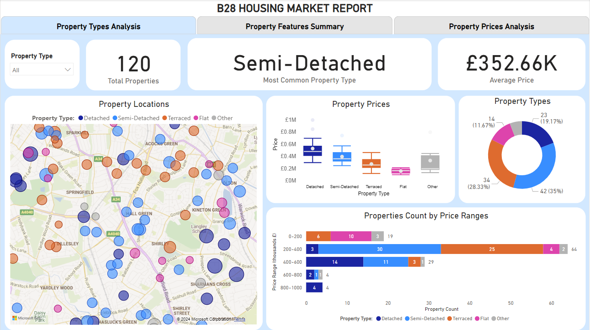

### Property Features:
- Properties with available `Garden`: **90%**.
- Properties with available `Parking` spots: **89%**.
- Most common size: Properties with **3 bedrooms** (**50%**).
- `Single-bedroom` properties: **3.3%** (**4 properties**).

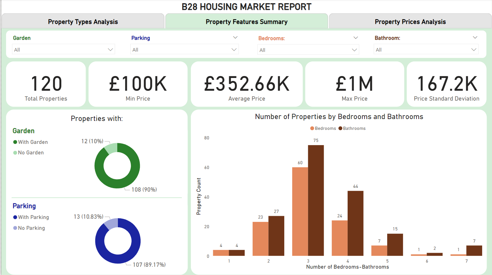

### Property Price:
- Average price: **£352,660**, with Standard Deviation of **167,200**. 
- **B28** average price is **35.8% higher** than **Birmingham's** average of **£234,000**.
- **B28** average prices are **higher** than **Birmingham's** for **all types**, except `Flats`.
- Most influential factors to price and its estimation: 
  - Number of `Bedrooms`.
  - Number of `Bathrooms`
  - Property `Council Tax Band`.

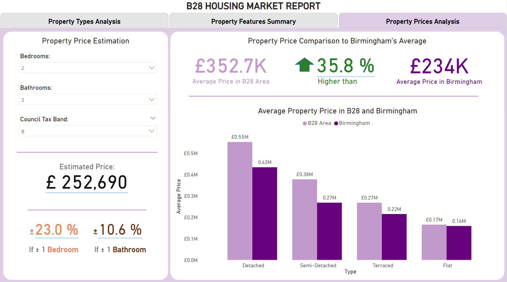

### Proposed Questions:
- Are there specific property types or price ranges the agency is most interested in targeting?
- Who are the primary buyers the agency aims to attract (e.g., families, singles, investors)?
- Beyond B28, are there other areas in Birmingham the agency wants to benchmark against?

## Insights Deep-dive

### 1. Property Types: 

Houses (`Detached`, `Semi-Detached`, `Terraced`, etc.) is the main property type that is listed in the area, with **82.5%**:

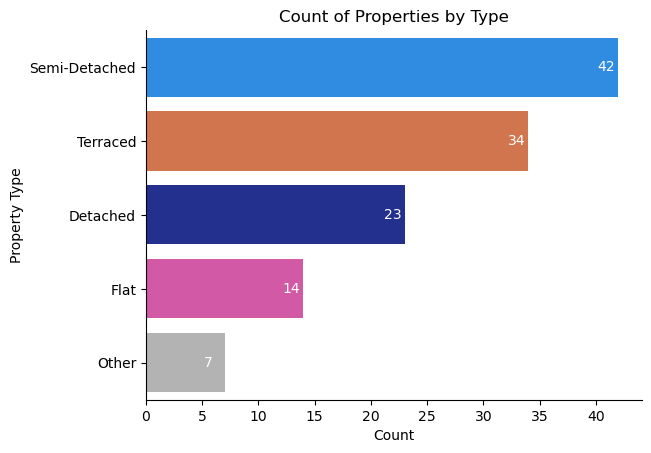

### 2. Property Features and Sizes:

Property Size:
- The maximum `Number of Bedrooms` for `Flats` is **2**.
- Most `Semi-Detached` and `Terraced` properties have **3 bedrooms**. While most of `Detached` properties have **4 bedrooms**.
- There are no `Detached` properties with less than **3 bedrooms**. 

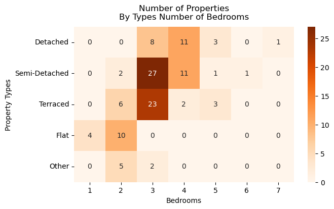

`Garden` and `Parking` availability:

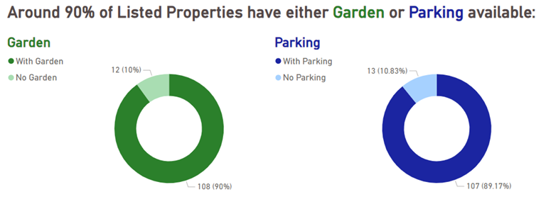

Property `Tenure`:

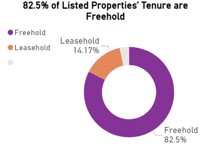

Property Locations:
- Most of `Terraced` properties are located near the North of the area.
- With bubble sizes corresponding to Price, properties around Sharman Cross and Kineton Green generally have higher prices. 

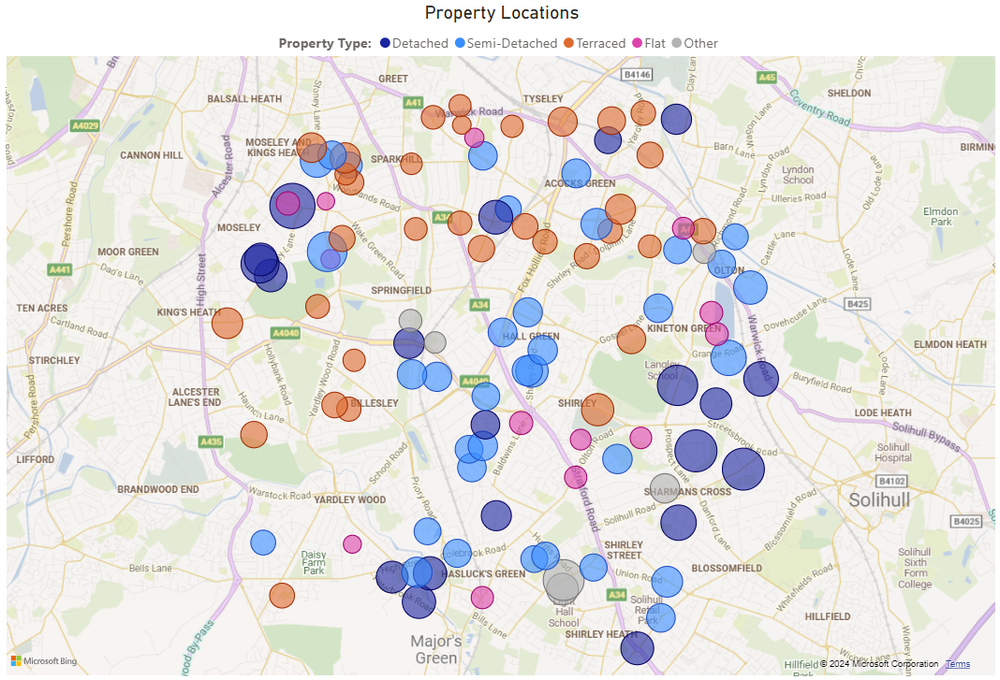

### 3. Property Price:

Most popular Price Range: **£200K to £400K**

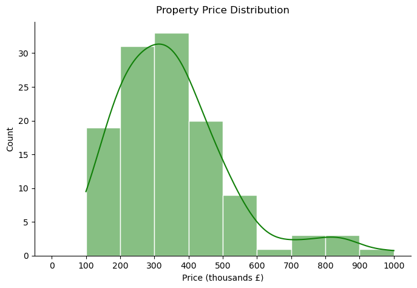

Generally, for the same `Number of Bedrooms`, `Detached` properties have the highest prices, followed by `Semi-Detached` and then `Terraced`, while `Flats` have the lowest.

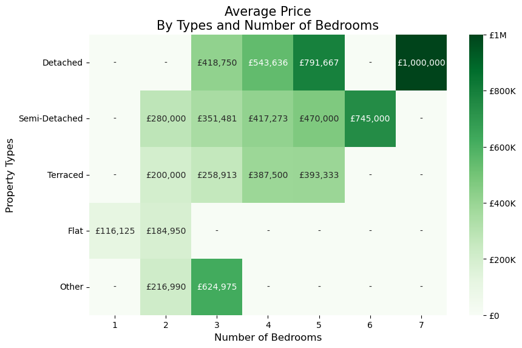

The 95% Confidence Interval of Property Price: `Other` properties have the largest spread, while `Detached` shows the highest average and large spread, suggesting high uncertainty in its true average price.

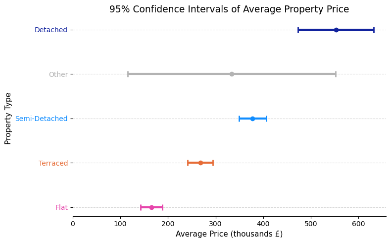

According to the Statistical Test results, **B28** Average Prices comparing to **Birmingham's**:
- Overall, **B28** average price is **35.8% higher** than **Birmingham's** average of **£234,000**.
- **B28** average prices are **higher** than **Birmingham's** for **all types**, except `Flats` - where both averages are similar, around **£160,000**.

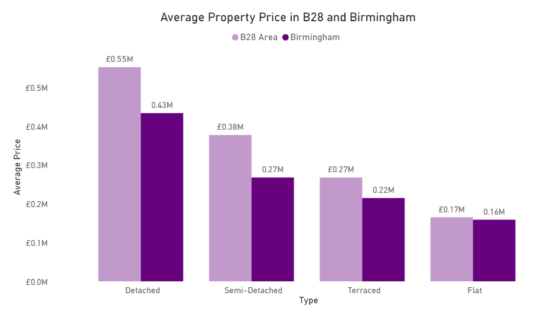

Most Influential Factors to Price: 
  - Number of `Bedrooms`, with Correlation Coefficient: **0.76**.
  - Number of `Bathrooms`, with Correlation Coefficient: **0.6**.
  - Property `Council Tax Band`, with Correlation Coefficient: **0.83**.

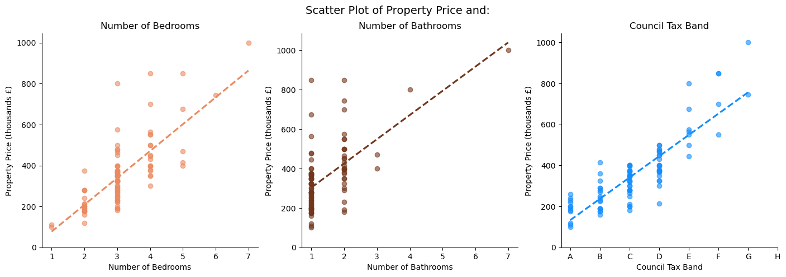

The Price Estimation Model, with Adjusted R2 of 0.86:

$$\text{Price} = 58124.3 \cdot \text{number of bedrooms} + 26910.2 \cdot \text{number of bathrooms} + 57863.9 \cdot \text{tax band rank} - 59998.33 $$


## Recommendations
- Main Products: Houses (`Detached, Semi-Detached or Terraced`), with more than `3 Bedrooms`.
- Target Buyers: Families looking for a 3 to 4-bedroom home with easy access to schools and stations within a 1-mile radius.
- Properties priced within the **£200K–£400K** range, which accounts for more than **50%** of listings, as this aligns with the budget of the majority of potential buyers.
- Market the **B28** area as a desirable location for buyers and investors seeking higher-value properties, highlighting the premium opportunities for `Detached` and `Semi-detached` properties, while noting that `Flats` may offer relatively lower values that are close to wider Birmingham averages. 
